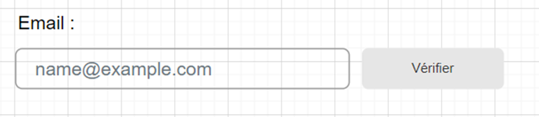
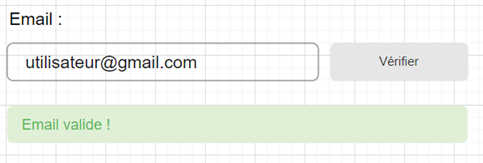
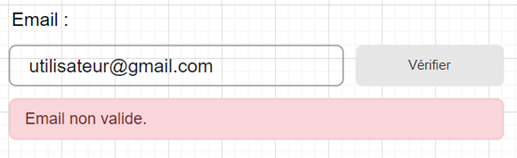
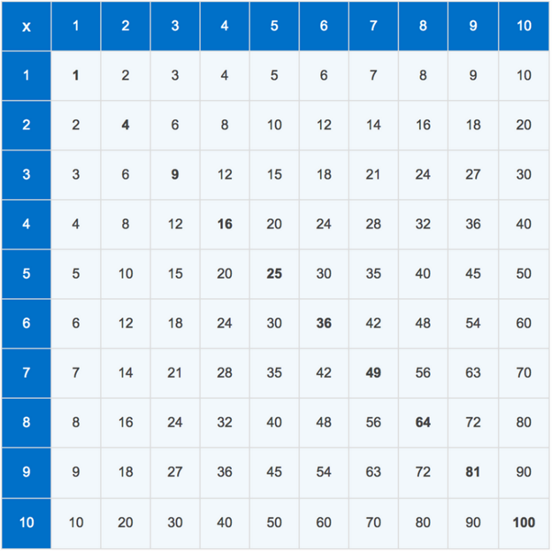
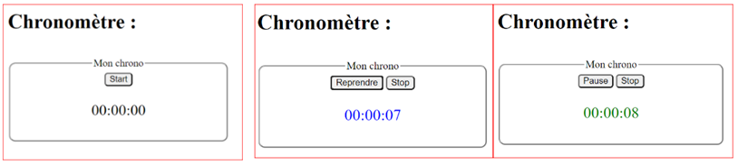

# Manipulation de DOM en Javascript

## Introduction

Cette série d'exercices vous permettra de vous entraîner à la manipulation de [DOM](https://fr.wikipedia.org/wiki/Document_Object_Model) en JavaScript.

Du code à compléter et disponible dans le dossier `src` de ce dépôt.

Vous pouvez "forker" le dépôt afin de faire une copie dans votre espace personnel.

---

## Afficheur de date

Complétez le code fourni sur le dépôt Git, vous aurez à modifier les fichiers "date-dom.html" et "date-dom.js".

Ajoutez un évènement permettant de gérer le clic sur le bouton "Afficher" (la façon de gérer les évènements est indiquée dans le cours portant sur JS).

La fonction ainsi appelée devra s’adapter au choix de l’utilisateur (en fonction de la date choisie et de la "radio button" sélectionnée) :
- Si "Jour" est sélectionné : affichage du jour en toutes lettres de la date choisie (utilisation de la méthode ["getDay()"](https://developer.mozilla.org/fr/docs/Web/JavaScript/Reference/Global_Objects/Date/getDay) de la classe "Date" possible)
- Si "Mois" est sélectionné : affichage du mois en toutes lettres de la date choisie (utilisation de la méthode ["getMonth()"](https://developer.mozilla.org/fr/docs/Web/JavaScript/Reference/Global_Objects/Date/getMonths) de la classe "Date possible")
- Si "Jours restants avant la fin de l’année" est sélectionné : afficher les jours restants.

Ajoutez un évènement au bouton sans modifier l’élément HTML d’identifiant « button-choice ».

Pour se faire, vous allez devoir manipuler le DOM de la page en récupérant un élément (favorisez l’utilisation de la méthode ["« "getQuerySelector()" de la classe "Document"](https://developer.mozilla.org/fr/docs/Web/API/Document/querySelector)).

---

## Vérification de formulaire

### Objectif

Créez une page html proposant à l’utilisateur le formulaire présenté par la maquette suivante :



Un clic sur le bouton « Vérifier » devra faire apparaître une alerte comme présentée par les figures ci-dessous :





### Vérification de l'adresse email

Vous pourrez créer une fonction de vérification d'adresse emailk, par exemple déclarée de la façon suivante :

```js
function checkEmail(stringToCheck)
```

Cette fonction pourra effectuer une opération de vérification de chaîne de caractère basée sur l'utilisation d'un expression régulière (aussi appellée "regex").

> ![TIP]
> Pour apprendre à constuire des expressions régulières vous pourrez utiliser la ressource suivante : [https://regexlearn.com/fr/learn/regex101](https://regexlearn.com/fr/learn/regex101)

---

## Table de multiplication

L’objectif est ici de générer le DOM d’une page HTML afin d’afficher une table de multiplication.

Voici un exemple de rendu attendu :



Pour rappel, un tableau en HTML se structure de la façon suivante : [https://www.w3schools.com/html/html_tables.asp](https://www.w3schools.com/html/html_tables.asp)

En Javascript, il vous est possible de créer un élément « table » en utilisant « document.createElement() » puis d’ajouter des lignes en utilisant « [HTMLTableElement.insertRow()](https://developer.mozilla.org/en-US/docs/Web/API/HTMLTableElement/insertRow) ».

Vous serez également en capacité d’insérer des cellules dans un élément de type ligne en utilisant « [HTMLTableRowElement.insertCell()](https://developer.mozilla.org/en-US/docs/Web/API/HTMLTableRowElement/insertCell) ».


---

## Chronomètre

### Objectif

L’objectif de cet exercice est de coder un chronomètre affichant le temps passé à la seconde près.



Actions des boutons :
•	« Start » : démarrage du chronomètre 
•	« Pause » : suspend le temps, affichage de « Reprendre » si en pause
•	« Stop » : arrête et remet à 0 le chronomètre

## Utilisation de la fonction "setInterval()"

Il vous faudra utiliser la méthode « setInterval() » de la classe Window pour mesurer le temps passé.

Avant de compléter le code du chronomètre, essayez cette fonction en affichant en console un message indiquant la date et l’heure à la seconde près, ceci toutes les 2 secondes.

Vous trouverez plus d'information sur le fonctionnement de "setInterval()" sur [cet article](https://fr.javascript.info/settimeout-setinterval#setinterval).

## Implémentation des différentes fonctions

Une fois « setInterval() » compris, complétez les fonctions « start() », « pause() » et « stop() » afin d’implémenter le chronomètre.
Vous pourrez utiliser des objets de la classe « Date » afin de garder en mémoire le temps de départ du chronomètre.

Il vous est possible de retrouver le temps écoulé entre deux dates en les soustrayant comme présenté par l’exemple suivant : https://developer.mozilla.org/fr/docs/Web/JavaScript/Reference/Global_Objects/Date/Date

**Attention cependant, la différence renvoie le temps en millisecondes**, à vous de traiter le résultat obtenu afin de l’adapter à votre cas.
